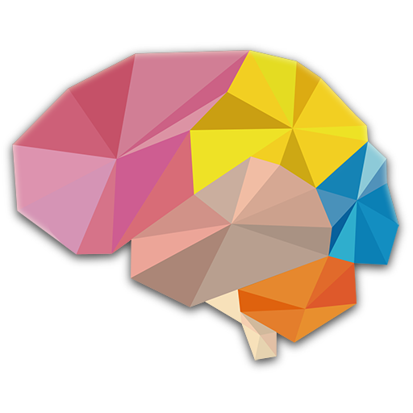

<div align="center">



# BrainStorm

**Android-клон культовой интеллектуальной PvP-игры BrainWars.**

Jetpack Compose UI, многослойная навигация, игровые механики, Firebase-интеграция, локальное хранение и анимации.


</div>

---

# 🧠 Обзор

**BrainStorm** — это Android-реализация культовой интеллектуальной PvP-игры на развитие способностей мозга, в которой два игрока соревнуются в когнитивных мини-играх: на логику, внимание, память, скорость реакции, точность и вычисление. **Проект** воспроизводит весь оригинальный функционал и визуальный стиль оригинального BrainWars, включая онлайн режим, систему микроигр, подсчёт очков, анимации и интерфейс в реальном времени. 
- [Фотогалерея](#фотогалерея)

---

## 🚀 Что реализовано

- 🎮 Игровой контур с раундами, подсчётом очков и экраном результатов.
- 🧩 Две полноценно реализованные мини-игры: **Flick Master** и **Path to Safety** *(остальные простые, не стал воспроизводить)*.
- 🧠 Каркас и визуальные ресурсы для дополнительных когнитивных мини-игр BrainWars.
- 👥 Пользовательские профили, друзья, запросы в друзья и чат.
- 🔐 Регистрация, авторизация и восстановление пароля через **Firebase Authentication**.
- ☁️ Синхронизация пользовательских и игровых данных через **Cloud Firestore**.
- 💾 Локальное хранение данных через **Room**.
- 🧭 Многоэкранная навигация на **Navigation Compose**.
- 📊 Игровая и пользовательская статистика.
- 💥 Анимации, интерактивный feedback и звуковое сопровождение.

---

## 🧬 Архитектура

Проект организован по слоям **presentation → domain → data** и использует MVVM-подход:

- **Presentation** — Jetpack Compose screens, ViewModel, UI state.
- **Domain** — entities, repository contracts, use cases.
- **Data** — Room, Firebase, mappers и repository implementation.
- **Dependency Injection** — Dagger 2 с собственными modules/components.
- **Async / state** — Kotlin Coroutines, Flow / StateFlow.

```text
presentation
    ↓
domain (use cases + repository contracts)
    ↓
data (Room + Firebase + mappers)
```

---

## 🛠️ Технологии и стек

| Категория | Использовано |
|---|---|
| Язык | Kotlin |
| UI | Jetpack Compose, Material 3 |
| Архитектура | MVVM + Clean Architecture |
| State management | ViewModel, Compose State, Flow / StateFlow |
| Dependency Injection | Dagger 2 |
| Асинхронность | Kotlin Coroutines |
| Навигация | Navigation Compose |
| Backend services | Firebase Authentication, Cloud Firestore |
| Локальное хранение | Room |
| Сериализация / HTTP-support | Gson, OkHttp logging, Retrofit converter |
| Сборка | Gradle Kotlin DSL (KTS) |
| Android | minSdk 26, targetSdk 34 |
| Test infrastructure | JUnit, AndroidX Test, Compose UI Test |

---

## 🎮 Игровой scope

В репозитории представлены экраны и ресурсы для нескольких режимов BrainWars, но как самостоятельные игровые механики полностью реализованы две мини-игры:

- **Flick Master** — реакция и обработка направления/цвета.
- **Path to Safety** — поиск безопасного пути с собственной игровой логикой.

Остальные режимы оставлены как расширяемый каркас/визуальные заготовки.

---

## 📱 Основные разделы приложения

1. **Splash** — стартовый логотип, авто-переход на главное меню  
2. **Главный экран** — кнопки матчей, рейтинг, профиль  
3. **Matchmaking** — подбор соперника (PvP в реальном времени)  
4. **Раунды 1 → 2 → 3** — микроигры (арифметика, память, реакция)  
5. **Итог матча** — победитель, счёт, аналитика по раундам  
6. **Лидерборд** — локальный рейтинг и между друзьями
7. **Профиль** — уровень, пользовательская информация, статистика, аватар
8. **Настройки** — звук, язык, регистрация и выход из аккаунта, прочие настройки

---

## 🛠️ Технологии и стек

| Категория              | Использовано                                        |
|------------------------|-----------------------------------------------------|
| Язык                   | Kotlin                                              |
| UI-фреймворк           | Jetpack Compose                                     |
| Архитектура            | MVVM + Clean Architecture                           |
| Состояние              | Compose state, ViewModel + Flow                     |
| DI                     | Hilt                                                |
| Асинхронность          | Kotlin Coroutines                                   |
| Навигация              | Navigation Compose                                  |
| Состояние              | ViewModel + StateFlow                               |
| Анимации               | Compose Animations API                              |
| Тестирование           | JUnit, MockK, Compose UI Test                       |
| Хранение               | Room / SharedPreferences                            |
| Сборка                 | Gradle (KTS)                                        |

---

## 🧩 Функциональные возможности

### 🎮 Игровой процесс
- Быстрые PvP-сессии из **3 раундов** с набором когнитивных мини-игр.
- Типы игр:
  - Арифметика и логика
  - Внимание и реакция
  - Кратковременная память
  - Скорость и точность
- Интерактивная шкала очков, реакция на скорость и точность.

### 🧩 Игровая логика
- Асинхронная логика завершения раунда.
- Поддержка оффлайн-режима для тренировки.
- Система подсчёта, анализа, отображения результатов и др.


---

## 💥 Потенциал расширения

- 📊 Firebase Analytics / Crashlytics
- 🌐 Режим онлайн-игры (Firebase Realtime | со сложной логикой)
- 🌍 Мультиязычность (`strings.xml`)
- 🧬 Новые микроигры (добавляются по шаблону)

---

## Фотогалерея

<p float="left">
  
  
  
  
</p>

<p float="left">
  
  
  
</p>

<p float="left">
  
  
  
</p>

<p float="left">
  
  
  
</p>

<p float="left">
  
  
  
</p>

<p float="left">
  
  
  
  
</p>
